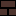

# Brick

| Block                     | ID                               | Material | Color       | Tint | Level | Preview                                                                                    |
| ------------------------- | -------------------------------- | -------- | ----------- | ---- | ----- | ------------------------------------------------------------------------------------------ |
| 25% Brick Red 50          | rainbow:red_50_brick_25          | Brick    | Red         | 50   | 25    |                    |
| 25% Brick Red 100         | rainbow:red_100_brick_25         | Brick    | Red         | 100  | 25    |                  |
| 25% Brick Red 200         | rainbow:red_200_brick_25         | Brick    | Red         | 200  | 25    |                  |
| 25% Brick Red 300         | rainbow:red_300_brick_25         | Brick    | Red         | 300  | 25    |                  |
| 25% Brick Red 400         | rainbow:red_400_brick_25         | Brick    | Red         | 400  | 25    |                  |
| 25% Brick Red 500         | rainbow:red_500_brick_25         | Brick    | Red         | 500  | 25    |                  |
| 25% Brick Red 600         | rainbow:red_600_brick_25         | Brick    | Red         | 600  | 25    |                  |
| 25% Brick Red 700         | rainbow:red_700_brick_25         | Brick    | Red         | 700  | 25    |                  |
| 25% Brick Red 800         | rainbow:red_800_brick_25         | Brick    | Red         | 800  | 25    |                  |
| 25% Brick Red 900         | rainbow:red_900_brick_25         | Brick    | Red         | 900  | 25    |                  |
| 25% Brick Pink 50         | rainbow:pink_50_brick_25         | Brick    | Pink        | 50   | 25    |                  |
| 25% Brick Pink 100        | rainbow:pink_100_brick_25        | Brick    | Pink        | 100  | 25    |                |
| 25% Brick Pink 200        | rainbow:pink_200_brick_25        | Brick    | Pink        | 200  | 25    |                |
| 25% Brick Pink 300        | rainbow:pink_300_brick_25        | Brick    | Pink        | 300  | 25    |                |
| 25% Brick Pink 400        | rainbow:pink_400_brick_25        | Brick    | Pink        | 400  | 25    |                |
| 25% Brick Pink 500        | rainbow:pink_500_brick_25        | Brick    | Pink        | 500  | 25    |                |
| 25% Brick Pink 600        | rainbow:pink_600_brick_25        | Brick    | Pink        | 600  | 25    |                |
| 25% Brick Pink 700        | rainbow:pink_700_brick_25        | Brick    | Pink        | 700  | 25    |                |
| 25% Brick Pink 800        | rainbow:pink_800_brick_25        | Brick    | Pink        | 800  | 25    |                |
| 25% Brick Pink 900        | rainbow:pink_900_brick_25        | Brick    | Pink        | 900  | 25    |                |
| 25% Brick Purple 50       | rainbow:purple_50_brick_25       | Brick    | Purple      | 50   | 25    |              |
| 25% Brick Purple 100      | rainbow:purple_100_brick_25      | Brick    | Purple      | 100  | 25    |            |
| 25% Brick Purple 200      | rainbow:purple_200_brick_25      | Brick    | Purple      | 200  | 25    |            |
| 25% Brick Purple 300      | rainbow:purple_300_brick_25      | Brick    | Purple      | 300  | 25    |            |
| 25% Brick Purple 400      | rainbow:purple_400_brick_25      | Brick    | Purple      | 400  | 25    |            |
| 25% Brick Purple 500      | rainbow:purple_500_brick_25      | Brick    | Purple      | 500  | 25    |            |
| 25% Brick Purple 600      | rainbow:purple_600_brick_25      | Brick    | Purple      | 600  | 25    |            |
| 25% Brick Purple 700      | rainbow:purple_700_brick_25      | Brick    | Purple      | 700  | 25    |            |
| 25% Brick Purple 800      | rainbow:purple_800_brick_25      | Brick    | Purple      | 800  | 25    |            |
| 25% Brick Purple 900      | rainbow:purple_900_brick_25      | Brick    | Purple      | 900  | 25    |            |
| 25% Brick Deep Purple 50  | rainbow:deep_purple_50_brick_25  | Brick    | Deep Purple | 50   | 25    |    |
| 25% Brick Deep Purple 100 | rainbow:deep_purple_100_brick_25 | Brick    | Deep Purple | 100  | 25    |  |
| 25% Brick Deep Purple 200 | rainbow:deep_purple_200_brick_25 | Brick    | Deep Purple | 200  | 25    |  |
| 25% Brick Deep Purple 300 | rainbow:deep_purple_300_brick_25 | Brick    | Deep Purple | 300  | 25    |  |
| 25% Brick Deep Purple 400 | rainbow:deep_purple_400_brick_25 | Brick    | Deep Purple | 400  | 25    |  |
| 25% Brick Deep Purple 500 | rainbow:deep_purple_500_brick_25 | Brick    | Deep Purple | 500  | 25    |  |
| 25% Brick Deep Purple 600 | rainbow:deep_purple_600_brick_25 | Brick    | Deep Purple | 600  | 25    |  |
| 25% Brick Deep Purple 700 | rainbow:deep_purple_700_brick_25 | Brick    | Deep Purple | 700  | 25    |  |
| 25% Brick Deep Purple 800 | rainbow:deep_purple_800_brick_25 | Brick    | Deep Purple | 800  | 25    |  |
| 25% Brick Deep Purple 900 | rainbow:deep_purple_900_brick_25 | Brick    | Deep Purple | 900  | 25    |  |
| 25% Brick Indigo 50       | rainbow:indigo_50_brick_25       | Brick    | Indigo      | 50   | 25    |              |
| 25% Brick Indigo 100      | rainbow:indigo_100_brick_25      | Brick    | Indigo      | 100  | 25    |            |
| 25% Brick Indigo 200      | rainbow:indigo_200_brick_25      | Brick    | Indigo      | 200  | 25    |            |
| 25% Brick Indigo 300      | rainbow:indigo_300_brick_25      | Brick    | Indigo      | 300  | 25    |            |
| 25% Brick Indigo 400      | rainbow:indigo_400_brick_25      | Brick    | Indigo      | 400  | 25    |            |
| 25% Brick Indigo 500      | rainbow:indigo_500_brick_25      | Brick    | Indigo      | 500  | 25    |            |
| 25% Brick Indigo 600      | rainbow:indigo_600_brick_25      | Brick    | Indigo      | 600  | 25    |            |
| 25% Brick Indigo 700      | rainbow:indigo_700_brick_25      | Brick    | Indigo      | 700  | 25    |            |
| 25% Brick Indigo 800      | rainbow:indigo_800_brick_25      | Brick    | Indigo      | 800  | 25    |            |
| 25% Brick Indigo 900      | rainbow:indigo_900_brick_25      | Brick    | Indigo      | 900  | 25    |            |
| 25% Brick Blue Gray 50    | rainbow:blue_gray_50_brick_25    | Brick    | Blue Gray   | 50   | 25    |        |
| 25% Brick Blue Gray 100   | rainbow:blue_gray_100_brick_25   | Brick    | Blue Gray   | 100  | 25    |      |
| 25% Brick Blue Gray 200   | rainbow:blue_gray_200_brick_25   | Brick    | Blue Gray   | 200  | 25    |      |
| 25% Brick Blue Gray 300   | rainbow:blue_gray_300_brick_25   | Brick    | Blue Gray   | 300  | 25    |      |
| 25% Brick Blue Gray 400   | rainbow:blue_gray_400_brick_25   | Brick    | Blue Gray   | 400  | 25    |      |
| 25% Brick Blue Gray 500   | rainbow:blue_gray_500_brick_25   | Brick    | Blue Gray   | 500  | 25    |      |
| 25% Brick Blue Gray 600   | rainbow:blue_gray_600_brick_25   | Brick    | Blue Gray   | 600  | 25    |      |
| 25% Brick Blue Gray 700   | rainbow:blue_gray_700_brick_25   | Brick    | Blue Gray   | 700  | 25    |      |
| 25% Brick Blue Gray 800   | rainbow:blue_gray_800_brick_25   | Brick    | Blue Gray   | 800  | 25    |      |
| 25% Brick Blue Gray 900   | rainbow:blue_gray_900_brick_25   | Brick    | Blue Gray   | 900  | 25    |      |
| 25% Brick Blue 50         | rainbow:blue_50_brick_25         | Brick    | Blue        | 50   | 25    |                  |
| 25% Brick Blue 100        | rainbow:blue_100_brick_25        | Brick    | Blue        | 100  | 25    |                |
| 25% Brick Blue 200        | rainbow:blue_200_brick_25        | Brick    | Blue        | 200  | 25    |                |
| 25% Brick Blue 300        | rainbow:blue_300_brick_25        | Brick    | Blue        | 300  | 25    |                |
| 25% Brick Blue 400        | rainbow:blue_400_brick_25        | Brick    | Blue        | 400  | 25    |                |
| 25% Brick Blue 500        | rainbow:blue_500_brick_25        | Brick    | Blue        | 500  | 25    |                |
| 25% Brick Blue 600        | rainbow:blue_600_brick_25        | Brick    | Blue        | 600  | 25    |                |
| 25% Brick Blue 700        | rainbow:blue_700_brick_25        | Brick    | Blue        | 700  | 25    |                |
| 25% Brick Blue 800        | rainbow:blue_800_brick_25        | Brick    | Blue        | 800  | 25    |                |
| 25% Brick Blue 900        | rainbow:blue_900_brick_25        | Brick    | Blue        | 900  | 25    |                |
| 25% Brick Light Blue 50   | rainbow:light_blue_50_brick_25   | Brick    | Light Blue  | 50   | 25    |      |
| 25% Brick Light Blue 100  | rainbow:light_blue_100_brick_25  | Brick    | Light Blue  | 100  | 25    |    |
| 25% Brick Light Blue 200  | rainbow:light_blue_200_brick_25  | Brick    | Light Blue  | 200  | 25    |    |
| 25% Brick Light Blue 300  | rainbow:light_blue_300_brick_25  | Brick    | Light Blue  | 300  | 25    |    |
| 25% Brick Light Blue 400  | rainbow:light_blue_400_brick_25  | Brick    | Light Blue  | 400  | 25    |    |
| 25% Brick Light Blue 500  | rainbow:light_blue_500_brick_25  | Brick    | Light Blue  | 500  | 25    |    |
| 25% Brick Light Blue 600  | rainbow:light_blue_600_brick_25  | Brick    | Light Blue  | 600  | 25    |    |
| 25% Brick Light Blue 700  | rainbow:light_blue_700_brick_25  | Brick    | Light Blue  | 700  | 25    |    |
| 25% Brick Light Blue 800  | rainbow:light_blue_800_brick_25  | Brick    | Light Blue  | 800  | 25    |    |
| 25% Brick Light Blue 900  | rainbow:light_blue_900_brick_25  | Brick    | Light Blue  | 900  | 25    |    |
| 25% Brick Cyan 50         | rainbow:cyan_50_brick_25         | Brick    | Cyan        | 50   | 25    |                  |
| 25% Brick Cyan 100        | rainbow:cyan_100_brick_25        | Brick    | Cyan        | 100  | 25    |                |
| 25% Brick Cyan 200        | rainbow:cyan_200_brick_25        | Brick    | Cyan        | 200  | 25    |                |
| 25% Brick Cyan 300        | rainbow:cyan_300_brick_25        | Brick    | Cyan        | 300  | 25    |                |
| 25% Brick Cyan 400        | rainbow:cyan_400_brick_25        | Brick    | Cyan        | 400  | 25    |                |
| 25% Brick Cyan 500        | rainbow:cyan_500_brick_25        | Brick    | Cyan        | 500  | 25    |                |
| 25% Brick Cyan 600        | rainbow:cyan_600_brick_25        | Brick    | Cyan        | 600  | 25    |                |
| 25% Brick Cyan 700        | rainbow:cyan_700_brick_25        | Brick    | Cyan        | 700  | 25    |                |
| 25% Brick Cyan 800        | rainbow:cyan_800_brick_25        | Brick    | Cyan        | 800  | 25    |                |
| 25% Brick Cyan 900        | rainbow:cyan_900_brick_25        | Brick    | Cyan        | 900  | 25    |                |
| 25% Brick Teal 50         | rainbow:teal_50_brick_25         | Brick    | Teal        | 50   | 25    |                  |
| 25% Brick Teal 100        | rainbow:teal_100_brick_25        | Brick    | Teal        | 100  | 25    |                |
| 25% Brick Teal 200        | rainbow:teal_200_brick_25        | Brick    | Teal        | 200  | 25    |                |
| 25% Brick Teal 300        | rainbow:teal_300_brick_25        | Brick    | Teal        | 300  | 25    |                |
| 25% Brick Teal 400        | rainbow:teal_400_brick_25        | Brick    | Teal        | 400  | 25    |                |
| 25% Brick Teal 500        | rainbow:teal_500_brick_25        | Brick    | Teal        | 500  | 25    |                |
| 25% Brick Teal 600        | rainbow:teal_600_brick_25        | Brick    | Teal        | 600  | 25    |                |
| 25% Brick Teal 700        | rainbow:teal_700_brick_25        | Brick    | Teal        | 700  | 25    |                |
| 25% Brick Teal 800        | rainbow:teal_800_brick_25        | Brick    | Teal        | 800  | 25    |                |
| 25% Brick Teal 900        | rainbow:teal_900_brick_25        | Brick    | Teal        | 900  | 25    |                |
| 25% Brick Green 50        | rainbow:green_50_brick_25        | Brick    | Green       | 50   | 25    |                |
| 25% Brick Green 100       | rainbow:green_100_brick_25       | Brick    | Green       | 100  | 25    |              |
| 25% Brick Green 200       | rainbow:green_200_brick_25       | Brick    | Green       | 200  | 25    |              |
| 25% Brick Green 300       | rainbow:green_300_brick_25       | Brick    | Green       | 300  | 25    |              |
| 25% Brick Green 400       | rainbow:green_400_brick_25       | Brick    | Green       | 400  | 25    |              |
| 25% Brick Green 500       | rainbow:green_500_brick_25       | Brick    | Green       | 500  | 25    |              |
| 25% Brick Green 600       | rainbow:green_600_brick_25       | Brick    | Green       | 600  | 25    |              |
| 25% Brick Green 700       | rainbow:green_700_brick_25       | Brick    | Green       | 700  | 25    |              |
| 25% Brick Green 800       | rainbow:green_800_brick_25       | Brick    | Green       | 800  | 25    |              |
| 25% Brick Green 900       | rainbow:green_900_brick_25       | Brick    | Green       | 900  | 25    |              |
| 25% Brick Light Green 50  | rainbow:light_green_50_brick_25  | Brick    | Light Green | 50   | 25    |    |
| 25% Brick Light Green 100 | rainbow:light_green_100_brick_25 | Brick    | Light Green | 100  | 25    |  |
| 25% Brick Light Green 200 | rainbow:light_green_200_brick_25 | Brick    | Light Green | 200  | 25    |  |
| 25% Brick Light Green 300 | rainbow:light_green_300_brick_25 | Brick    | Light Green | 300  | 25    |  |
| 25% Brick Light Green 400 | rainbow:light_green_400_brick_25 | Brick    | Light Green | 400  | 25    |  |
| 25% Brick Light Green 500 | rainbow:light_green_500_brick_25 | Brick    | Light Green | 500  | 25    |  |
| 25% Brick Light Green 600 | rainbow:light_green_600_brick_25 | Brick    | Light Green | 600  | 25    |  |
| 25% Brick Light Green 700 | rainbow:light_green_700_brick_25 | Brick    | Light Green | 700  | 25    |  |
| 25% Brick Light Green 800 | rainbow:light_green_800_brick_25 | Brick    | Light Green | 800  | 25    |  |
| 25% Brick Light Green 900 | rainbow:light_green_900_brick_25 | Brick    | Light Green | 900  | 25    |  |
| 25% Brick Lime 50         | rainbow:lime_50_brick_25         | Brick    | Lime        | 50   | 25    |                  |
| 25% Brick Lime 100        | rainbow:lime_100_brick_25        | Brick    | Lime        | 100  | 25    |                |
| 25% Brick Lime 200        | rainbow:lime_200_brick_25        | Brick    | Lime        | 200  | 25    |                |
| 25% Brick Lime 300        | rainbow:lime_300_brick_25        | Brick    | Lime        | 300  | 25    |                |
| 25% Brick Lime 400        | rainbow:lime_400_brick_25        | Brick    | Lime        | 400  | 25    |                |
| 25% Brick Lime 500        | rainbow:lime_500_brick_25        | Brick    | Lime        | 500  | 25    |                |
| 25% Brick Lime 600        | rainbow:lime_600_brick_25        | Brick    | Lime        | 600  | 25    |                |
| 25% Brick Lime 700        | rainbow:lime_700_brick_25        | Brick    | Lime        | 700  | 25    |                |
| 25% Brick Lime 800        | rainbow:lime_800_brick_25        | Brick    | Lime        | 800  | 25    |                |
| 25% Brick Lime 900        | rainbow:lime_900_brick_25        | Brick    | Lime        | 900  | 25    |                |
| 25% Brick Yellow 50       | rainbow:yellow_50_brick_25       | Brick    | Yellow      | 50   | 25    |              |
| 25% Brick Yellow 100      | rainbow:yellow_100_brick_25      | Brick    | Yellow      | 100  | 25    |            |
| 25% Brick Yellow 200      | rainbow:yellow_200_brick_25      | Brick    | Yellow      | 200  | 25    |            |
| 25% Brick Yellow 300      | rainbow:yellow_300_brick_25      | Brick    | Yellow      | 300  | 25    |            |
| 25% Brick Yellow 400      | rainbow:yellow_400_brick_25      | Brick    | Yellow      | 400  | 25    |            |
| 25% Brick Yellow 500      | rainbow:yellow_500_brick_25      | Brick    | Yellow      | 500  | 25    |            |
| 25% Brick Yellow 600      | rainbow:yellow_600_brick_25      | Brick    | Yellow      | 600  | 25    |            |
| 25% Brick Yellow 700      | rainbow:yellow_700_brick_25      | Brick    | Yellow      | 700  | 25    |            |
| 25% Brick Yellow 800      | rainbow:yellow_800_brick_25      | Brick    | Yellow      | 800  | 25    |            |
| 25% Brick Yellow 900      | rainbow:yellow_900_brick_25      | Brick    | Yellow      | 900  | 25    |            |
| 25% Brick Amber 50        | rainbow:amber_50_brick_25        | Brick    | Amber       | 50   | 25    |                |
| 25% Brick Amber 100       | rainbow:amber_100_brick_25       | Brick    | Amber       | 100  | 25    |              |
| 25% Brick Amber 200       | rainbow:amber_200_brick_25       | Brick    | Amber       | 200  | 25    |              |
| 25% Brick Amber 300       | rainbow:amber_300_brick_25       | Brick    | Amber       | 300  | 25    |              |
| 25% Brick Amber 400       | rainbow:amber_400_brick_25       | Brick    | Amber       | 400  | 25    |              |
| 25% Brick Amber 500       | rainbow:amber_500_brick_25       | Brick    | Amber       | 500  | 25    |              |
| 25% Brick Amber 600       | rainbow:amber_600_brick_25       | Brick    | Amber       | 600  | 25    |              |
| 25% Brick Amber 700       | rainbow:amber_700_brick_25       | Brick    | Amber       | 700  | 25    |              |
| 25% Brick Amber 800       | rainbow:amber_800_brick_25       | Brick    | Amber       | 800  | 25    |              |
| 25% Brick Amber 900       | rainbow:amber_900_brick_25       | Brick    | Amber       | 900  | 25    |              |
| 25% Brick Orange 50       | rainbow:orange_50_brick_25       | Brick    | Orange      | 50   | 25    |              |
| 25% Brick Orange 100      | rainbow:orange_100_brick_25      | Brick    | Orange      | 100  | 25    |            |
| 25% Brick Orange 200      | rainbow:orange_200_brick_25      | Brick    | Orange      | 200  | 25    |            |
| 25% Brick Orange 300      | rainbow:orange_300_brick_25      | Brick    | Orange      | 300  | 25    |            |
| 25% Brick Orange 400      | rainbow:orange_400_brick_25      | Brick    | Orange      | 400  | 25    |            |
| 25% Brick Orange 500      | rainbow:orange_500_brick_25      | Brick    | Orange      | 500  | 25    |            |
| 25% Brick Orange 600      | rainbow:orange_600_brick_25      | Brick    | Orange      | 600  | 25    |            |
| 25% Brick Orange 700      | rainbow:orange_700_brick_25      | Brick    | Orange      | 700  | 25    |            |
| 25% Brick Orange 800      | rainbow:orange_800_brick_25      | Brick    | Orange      | 800  | 25    |            |
| 25% Brick Orange 900      | rainbow:orange_900_brick_25      | Brick    | Orange      | 900  | 25    |            |
| 25% Brick Deep Orange 50  | rainbow:deep_orange_50_brick_25  | Brick    | Deep Orange | 50   | 25    |    |
| 25% Brick Deep Orange 100 | rainbow:deep_orange_100_brick_25 | Brick    | Deep Orange | 100  | 25    |  |
| 25% Brick Deep Orange 200 | rainbow:deep_orange_200_brick_25 | Brick    | Deep Orange | 200  | 25    |  |
| 25% Brick Deep Orange 300 | rainbow:deep_orange_300_brick_25 | Brick    | Deep Orange | 300  | 25    |  |
| 25% Brick Deep Orange 400 | rainbow:deep_orange_400_brick_25 | Brick    | Deep Orange | 400  | 25    |  |
| 25% Brick Deep Orange 500 | rainbow:deep_orange_500_brick_25 | Brick    | Deep Orange | 500  | 25    |  |
| 25% Brick Deep Orange 600 | rainbow:deep_orange_600_brick_25 | Brick    | Deep Orange | 600  | 25    |  |
| 25% Brick Deep Orange 700 | rainbow:deep_orange_700_brick_25 | Brick    | Deep Orange | 700  | 25    |  |
| 25% Brick Deep Orange 800 | rainbow:deep_orange_800_brick_25 | Brick    | Deep Orange | 800  | 25    |  |
| 25% Brick Deep Orange 900 | rainbow:deep_orange_900_brick_25 | Brick    | Deep Orange | 900  | 25    |  |
| 25% Brick Brown 50        | rainbow:brown_50_brick_25        | Brick    | Brown       | 50   | 25    |                |
| 25% Brick Brown 100       | rainbow:brown_100_brick_25       | Brick    | Brown       | 100  | 25    |              |
| 25% Brick Brown 200       | rainbow:brown_200_brick_25       | Brick    | Brown       | 200  | 25    |              |
| 25% Brick Brown 300       | rainbow:brown_300_brick_25       | Brick    | Brown       | 300  | 25    |              |
| 25% Brick Brown 400       | rainbow:brown_400_brick_25       | Brick    | Brown       | 400  | 25    |              |
| 25% Brick Brown 500       | rainbow:brown_500_brick_25       | Brick    | Brown       | 500  | 25    |              |
| 25% Brick Brown 600       | rainbow:brown_600_brick_25       | Brick    | Brown       | 600  | 25    |              |
| 25% Brick Brown 700       | rainbow:brown_700_brick_25       | Brick    | Brown       | 700  | 25    |              |
| 25% Brick Brown 800       | rainbow:brown_800_brick_25       | Brick    | Brown       | 800  | 25    |              |
| 25% Brick Brown 900       | rainbow:brown_900_brick_25       | Brick    | Brown       | 900  | 25    |              |
| 25% Brick Grey 50         | rainbow:grey_50_brick_25         | Brick    | Grey        | 50   | 25    |                  |
| 25% Brick Grey 100        | rainbow:grey_100_brick_25        | Brick    | Grey        | 100  | 25    |                |
| 25% Brick Grey 200        | rainbow:grey_200_brick_25        | Brick    | Grey        | 200  | 25    |                |
| 25% Brick Grey 300        | rainbow:grey_300_brick_25        | Brick    | Grey        | 300  | 25    |                |
| 25% Brick Grey 400        | rainbow:grey_400_brick_25        | Brick    | Grey        | 400  | 25    |                |
| 25% Brick Grey 500        | rainbow:grey_500_brick_25        | Brick    | Grey        | 500  | 25    |                |
| 25% Brick Grey 600        | rainbow:grey_600_brick_25        | Brick    | Grey        | 600  | 25    |                |
| 25% Brick Grey 700        | rainbow:grey_700_brick_25        | Brick    | Grey        | 700  | 25    |                |
| 25% Brick Grey 800        | rainbow:grey_800_brick_25        | Brick    | Grey        | 800  | 25    |                |
| 25% Brick Grey 900        | rainbow:grey_900_brick_25        | Brick    | Grey        | 900  | 25    |                |

